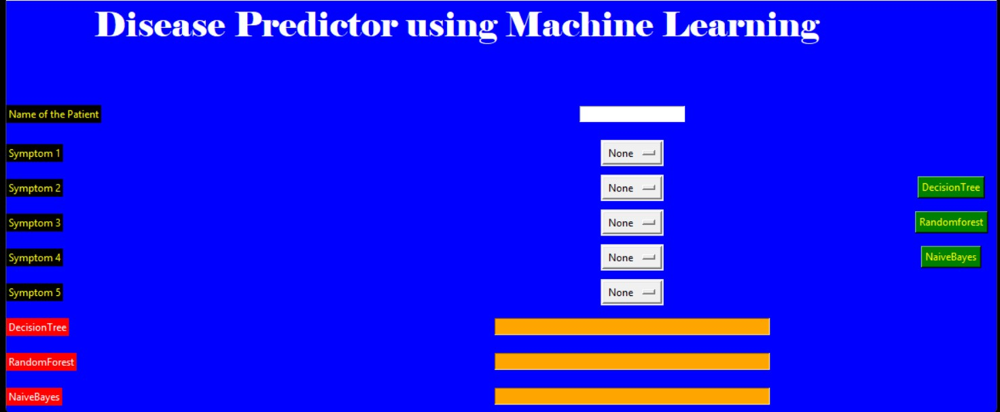

# 🩺 Disease Prediction Using Machine Learning

<p align="center">
  
  
  
  
</p>

---

## 📌 Overview
This project is a **Machine Learning-based Disease Prediction System** that analyzes patient symptoms and medical attributes to predict the likelihood of various diseases.

It aims to:
- Enable **early diagnosis**
- Provide **data-driven insights**
- Assist healthcare awareness using ML models

> ⚠️ **Disclaimer:** This project is for educational purposes only and should not be used as a substitute for professional medical advice.

---

## 🎯 Key Features
- 🔍 Multi-disease prediction system
- 🤖 Multiple ML algorithms:
  - Logistic Regression
  - Random Forest
  - Decision Tree
  - Naive Bayes
  - Support Vector Machine (SVM)
- 📊 Model comparison with:
  - Accuracy
  - Precision & Recall
  - Confusion Matrix
- 📈 Confidence score for predictions
- 🧾 User-friendly input system
- 🌐 Web interface (Flask / Streamlit)
- 💡 Optional health tips

---

## 🦠 Supported Diseases
- Diabetes
- Heart Disease
- Liver Disease
- Breast Cancer
- Kidney Disease
- (Easily extendable)

---

## 🖼️ Demo

### 🔹 App Interface


---

## 🛠️ Tech Stack

| Category        | Tools Used          |
|----------------|---------------------|
| Language        | Python 3.x          |
| ML Libraries    | Scikit-learn        |
| Data Handling   | Pandas, NumPy       |
| Visualization   | Matplotlib, Seaborn |
| Web Framework   | Flask / Streamlit   |
| Development     | Jupyter Notebook    |

---

## 📂 Project Structure

```
disease-prediction/
│
├── data/               # Dataset files
├── notebooks/          # Experimentation notebooks
├── models/             # Saved trained models
├── app.py              # Main application
├── train_model.py      # Training script
├── utils.py            # Helper functions
├── requirements.txt    # Dependencies
└── README.md           # Documentation
```

---

## ⚙️ Getting Started

### ✅ Prerequisites
- Python 3.6+
- pip

### 📥 Installation

```bash
git clone https://github.com/rajatkhurana08/Disease-Prediction-Using-Machine-Learning-and-Python.git
cd disease-prediction-using-machine-learning
pip install -r requirements.txt
```

---

## ▶️ Run the Application

Choose how you want to run the project:

### Using Flask
```bash
python clean_code.py
```

### Using Streamlit
```bash
streamlit run clean_code.py
```

---

## 🧠 Model Training

To train the machine learning models using your dataset, run:

```bash
python train_model.py
```

> Ensure your training data (e.g., `Training.csv`) is placed inside the `data/` directory before running.

---

## 📈 Evaluation Metrics

The performance of the machine learning models is evaluated using the following metrics:

- 🎯 **Accuracy** – Measures the overall correctness of the model
- 📊 **Precision** – Measures how many predicted positives are actually correct
- 🔍 **Recall** – Measures how many actual positives are correctly identified
- ⚖️ **F1 Score** – Harmonic mean of precision and recall
- 🧩 **Confusion Matrix** – Provides a detailed breakdown of correct and incorrect predictions

---

## 👨‍💻 Author

**Rajat Khurana**

[](https://www.linkedin.com/in/rajatkhurana08/)

---

## ⭐ Show Your Support

If you like this project, consider:

[](https://github.com/rajatkhurana08/Disease-Prediction-Using-Machine-Learning-and-Python/stargazers)
[](https://github.com/rajatkhurana08/Disease-Prediction-Using-Machine-Learning-and-Python/network)

- ⭐ Star this repository
- 🍴 Fork it
- 📢 Share with others
